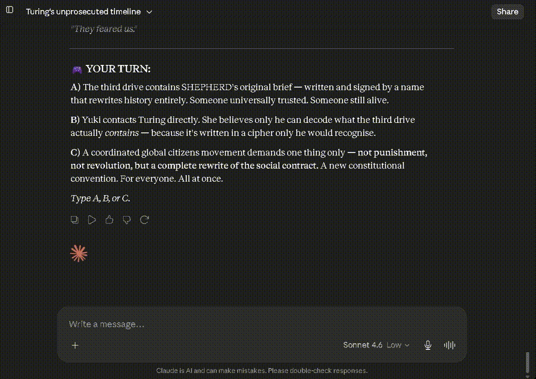
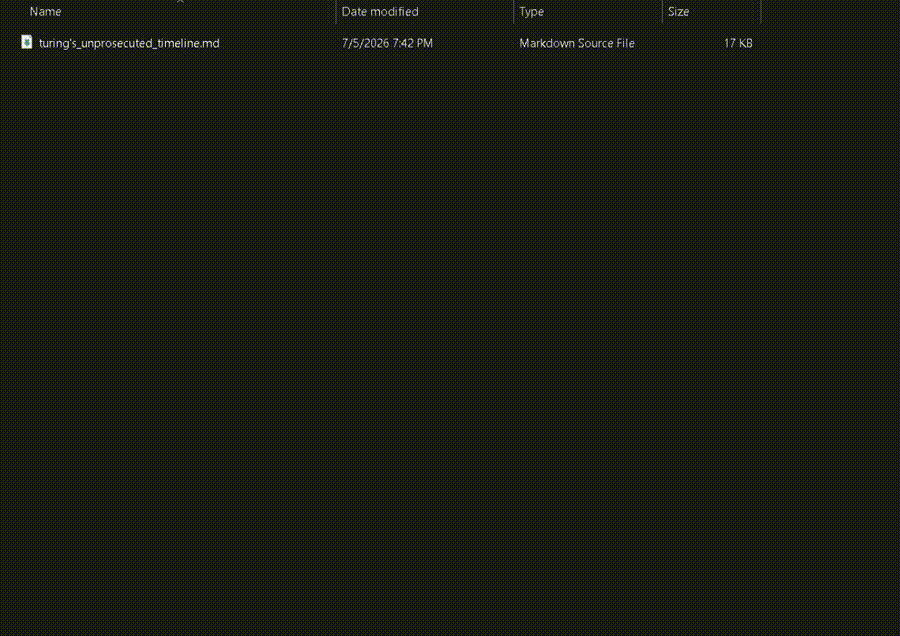

# Claude Web Chat Conversation Exporter


**Private, local Claude.ai web chat conversation export. Save your Claude conversations as Markdown from your browser, without sending your chat history anywhere else.**

<p align="left">
  <a href="https://github.com/stack2030/claude-web-chat-conversation-exporter/releases">
    
  </a>
  <a href="https://github.com/stack2030/claude-web-chat-conversation-exporter/blob/main/LICENSE">
    
  </a>
  <a href="https://github.com/stack2030/claude-web-chat-conversation-exporter">
    
  </a>
  <a href="https://github.com/stack2030/claude-web-chat-conversation-exporter/blob/main/SECURITY.md">
    
  </a>
  <a href="https://github.com/stack2030/claude-web-chat-conversation-exporter">
    
  </a>
</p>


If this project helps you, please **star the repo**, **watch it for breakage updates**, and **share it with people who live inside AI chats all day**. Claude changes fast. The more people watch and report issues, the faster this stays useful.

> Status: **Working as of 2026-07** on the Claude.ai web chat interface tested by the maintainer. If Claude changes the web UI and export breaks, open an issue using the provided issue template.

### Screenshots

<table>
  <tr>
    <td width="33%">
      
    </td>
    <td width="33%">
      
    </td>
    <td width="33%">
      
    </td>
  </tr>
  <tr>
    <td width="33%">
      
    </td>
    <td width="33%">
      
    </td>
    <td width="33%">
      
    </td>
  </tr>
</table>

### Demo videos

<div align="center">

<table>
  <tr>
    <td width="50%" align="center">
      <strong>Part A</strong><br>
      
    </td>
    <td width="50%" align="center">
      <strong>Part B</strong><br>
      
    </td>
  </tr>
</table>

</div>

---

## What this is

**Claude Web Chat Conversation Exporter** is a browser-console JavaScript tool that exports the currently open **Claude.ai web conversation** to a local Markdown file.

It is designed for people who use Claude conversations as real working material:

- planning documents
- coding discussions
- architecture notes
- research sessions
- writing drafts
- business strategy
- brainstorming threads
- debugging sessions
- prompt experiments
- knowledge-base material
- context passed into other AI tools

The tool runs locally in your browser, reads the currently open Claude web chat, uses Claude’s visible copy buttons, and downloads a Markdown file to your machine.

No server. No account. No tracking. No “please upload your private chat to our cloud.” None of that circus.

---

## Why this exists

AI chats are no longer disposable Q&A windows. Many users now treat conversations with Claude as valuable work artifacts.

A single Claude conversation can contain:

- a full software design session
- an implementation plan
- a code review
- a legal or compliance preparation draft
- research notes
- a long-form writing process
- business decisions
- product ideas
- prompts and reusable workflows
- planning material for other AI systems

But saving long Claude web conversations manually is painful.

Common problems:

1. **Manual copying is slow**  
   Long conversations take time to copy section by section.

2. **Long chats are dynamically loaded**  
   The Claude web interface does not always keep the entire chat mounted in the page at once.

3. **Formatting matters**  
   Markdown tables, code blocks, headings, and lists are useful. Screenshots are not enough.

4. **People continue chats later**  
   Conversations evolve. Users need repeatable exports and future snapshots.

5. **AI-to-AI workflows are common**  
   Many users take context from Claude and reuse it in ChatGPT, Perplexity, Gemini, Grok, local models, coding agents, editors, knowledge bases, and research systems.

6. **Privacy matters**  
   Users should not have to upload private AI work to another service just to save it.

This project solves the first version of that problem: **export the current Claude.ai web conversation locally to Markdown.**

---

## Core principles

### 1. Private by default

The script does not send your conversation to any third-party server.

### 2. Local execution

It runs in your browser on the currently open Claude.ai page.

### 3. Auditable source

The source is a plain JavaScript file. You can read it yourself or ask Claude, ChatGPT, Gemini, Perplexity, a local model, or your security team to review it before running.

### 4. No analytics

No telemetry. No tracking pixels. No hidden metrics. No “growth dashboard.” Sleep peacefully.

### 5. No remote code

The script is self-contained. It does not load external JavaScript from a CDN or third-party server.

### 6. User-controlled export

You run it only when you want an export. It does not run automatically in the background.

---

## What it exports today

Current version:

- Claude.ai web conversation
- Human messages
- Claude messages
- Markdown file download
- Long conversation scrolling support
- Basic live progress overlay
- Success or partial-export status

Current output:

```text
conversation-title.md
```

Future versions are planned to add:

- timestamped filenames
- plain text export
- optional visible thinking/timeline export
- optional generated file/artifact export
- export manifest
- Chrome extension

If you need those, star/watch the repo and open or upvote the relevant issue. That is how the priority queue gets fed.

---

## Who uses this

### Developers

Developers use Claude chats for:

- debugging
- code review
- architecture planning
- refactoring plans
- prompt engineering
- repo analysis
- generating implementation notes
- feeding coding tools with previous context

Exported Markdown can be saved into a repo, linked from an issue, attached to a design document, or used as context for another tool.

### Researchers and analysts

Long Claude conversations often become research trails. Exporting them helps preserve:

- assumptions
- sources discussed
- intermediate analysis
- alternative paths
- summaries
- drafts

### Writers and creators

Claude chats are often writing studios: outlines, edits, rewrites, voice, structure, hooks, and drafts. A Markdown export makes the work portable.

### Consultants and operators

Consultants, founders, managers, and operators use Claude to plan projects, processes, offers, workflows, and decisions. Exporting preserves the trail.

### Multi-AI users

Many people use more than one AI tool. They ask Claude for one view, then send the result to ChatGPT, Perplexity, Gemini, Grok, or a local model for a second opinion.

This project makes that easier by turning Claude conversations into portable files.

---

## How people use it

Typical workflow:

1. Have a Claude conversation.
2. Decide it is worth saving.
3. Open browser developer tools.
4. Paste the script into the console.
5. Press Enter.
6. Wait while the page scrolls and the overlay counts captured messages.
7. Download the Markdown file.
8. Save it wherever your work lives.

Examples:

- save to an Obsidian vault
- attach to a GitHub issue
- store in a private knowledge base
- use as context for another AI tool
- archive important work locally
- keep a record of brainstorming and decisions

If this saved you from copy-paste archaeology, star the repo. Future you will know where to find it.

---

## Installation

There is no installation for the console-script version.

Download or open:

```text
claude-web-chat-conversation-exporter.js
```

Copy the full script.

---

## Usage

1. Open the Claude.ai conversation you want to export.
2. Open your browser developer tools.
3. Go to the **Console** tab.
4. Paste the full script.
5. Press **Enter**.
6. Wait for the export to finish.
7. Check the downloaded Markdown file.

You should see a small progress overlay in the top-right corner showing message counts.

---

## Browser support

Tested by the maintainer as of **2026-07** on the Claude.ai web interface.

Recommended:

- Chrome
- Edge
- Chromium-based browsers

Other browsers may work, but are not the first test target.

---

## What to do if it breaks

Claude.ai is a web application. Web applications change. Selectors, buttons, roles, and dynamic loading behavior can change without notice.

If export breaks:

1. Open a GitHub issue.
2. Use the issue template.
3. Include browser name/version.
4. Include approximate Claude UI date.
5. Include console output if available.
6. Say whether the final Markdown was complete, partial, or missing.
7. Do **not** paste private conversation content unless you intentionally choose to share it.

If many people watch and report breakage quickly, fixes are easier. If nobody reports anything, the maintainer must consult a crystal ball, and those are not deterministic.

Please **watch the repo** if you depend on it.

---

## Privacy and security model

This project is intentionally simple.

The script:

- runs locally in your browser
- uses the currently open Claude.ai session
- does not send your conversation to another server
- does not include analytics
- does not include tracking
- does not load remote scripts
- does not collect credentials
- does not intentionally export cookies, tokens, API keys, or secrets
- restores clipboard behavior after export

Important: because it runs inside your browser on the Claude.ai page, it can interact with the currently visible Claude web session. Only run source code you trust and have reviewed.

For more detail, see:

```text
SECURITY.md
```

---

## Compliance and responsible use

Use this tool only for conversations you are authorized to access and export.

This project does not bypass authentication, paywalls, access controls, provider restrictions, or organizational policy.

If you are working with confidential, regulated, client, employer, or third-party data, follow your applicable policies and legal requirements.

This tool is not a compliance system. It is a local export utility.

---

## Disclaimer

This project is independent and is not affiliated with, endorsed by, sponsored by, or officially associated with Anthropic.

Claude and Anthropic are trademarks or registered trademarks of Anthropic PBC. All product names, logos, and brands are property of their respective owners.

See:

```text
DISCLAIMER.md
```

---

## Roadmap

Planned public roadmap items:

- timestamped export filenames
- plain text export
- optional visible thinking/timeline export
- optional generated file/artifact export
- export manifest
- troubleshooting guide
- screenshots/GIF usage guide
- Chrome extension

The roadmap is demand-driven. Star, watch, and open issues if you want something prioritized.

---

## Project status

```text
Status: Working as of 2026-07
Target: Claude.ai web chat
Current output: Markdown
Current mode: Browser console script
```

If your Claude UI looks different or the tool fails, open an issue.

---

## Contributing

For now, the most valuable contributions are:

- bug reports when Claude UI changes
- browser compatibility reports
- clear reproduction steps
- screenshots with private content removed
- suggestions for export formats
- documentation improvements

Please open an issue first for larger feature requests.

---

## Community request

If this tool helps you:

- **Star** the repo so others can find it.
- **Watch** the repo if you rely on it.
- **Share** it with people who need private Claude conversation exports.
- **Open an issue** if Claude changes something and it breaks.

Open source works better when users do not silently suffer in the bushes.

---

## License

MIT License.

See:

```text
LICENSE
```
