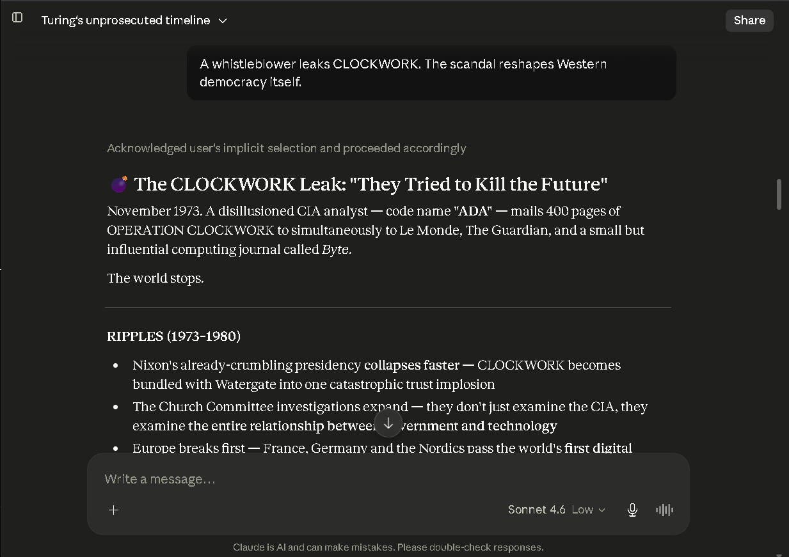
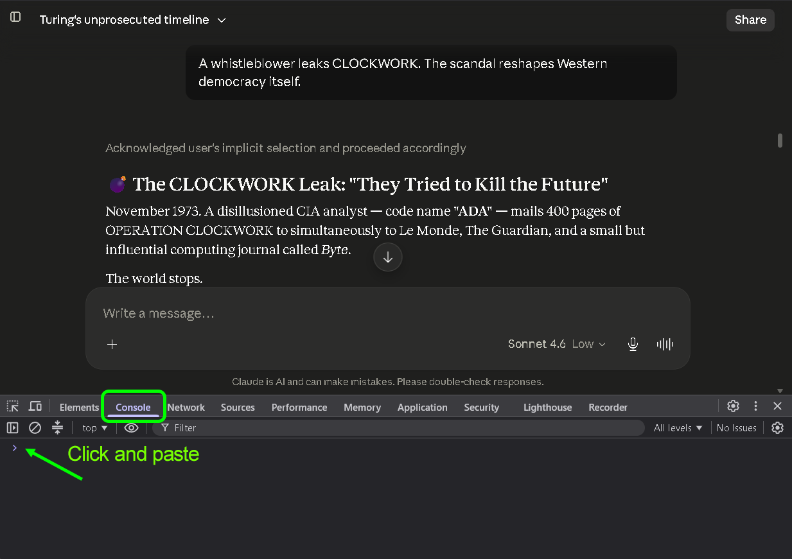
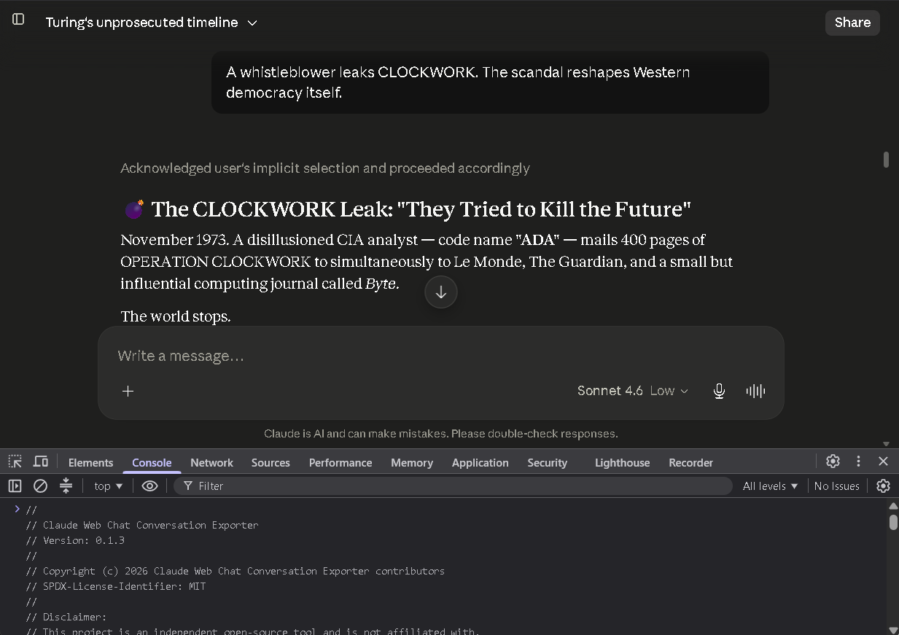
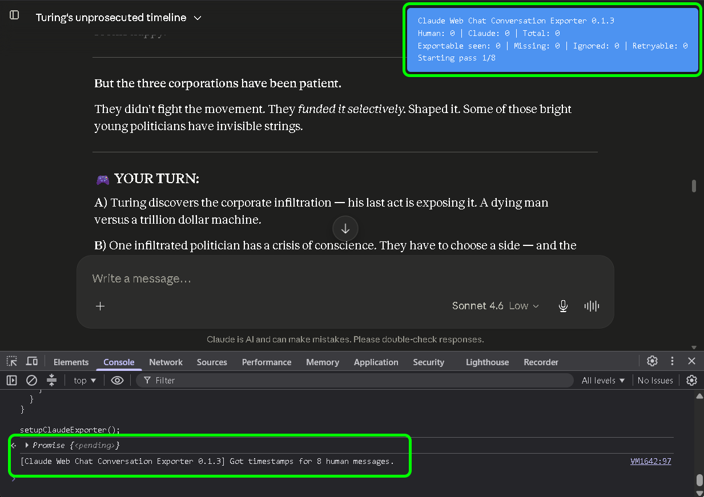
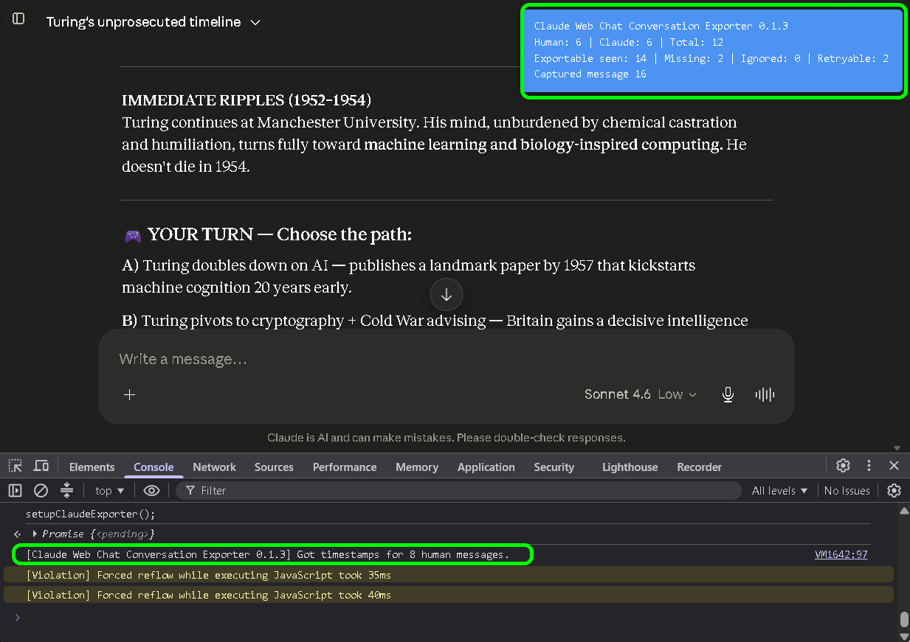
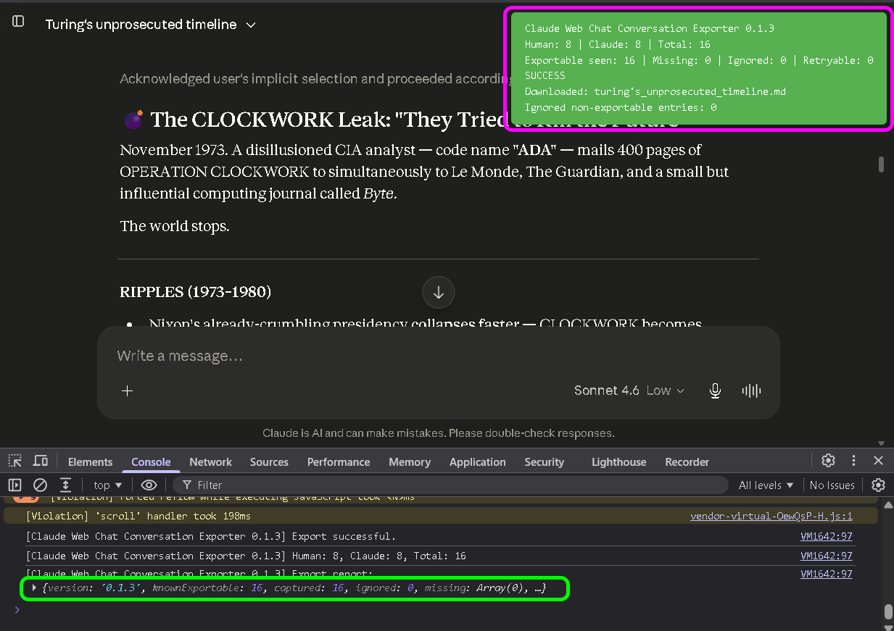

# Claude Web Chat Conversation Exporter Documentation

Welcome to the documentation page for **Claude Web Chat Conversation Exporter**.

This project helps users export Claude.ai web conversations locally to Markdown.

Project repo:

```text
https://github.com/stack2030/claude-web-chat-conversation-exporter
```

If the tool helps you, star the repo, watch it for Claude.ai UI breakage updates, and share it with people who need private local Claude conversation exports.

---

## Quick summary

Claude Web Chat Conversation Exporter is a local browser-console script for saving Claude.ai web chat conversations as Markdown files.

It is useful for:

- backups
- knowledge bases
- research archives
- coding sessions
- planning documents
- multi-AI workflows
- reusable context
- documentation trails
- local AI chat history archives

It is built around a simple privacy promise:

```text
Your Claude conversation should not need to visit another server just to become a file on your computer.
```

The current version runs inside your browser, uses Claude.ai’s visible copy buttons, and downloads a local Markdown file.

---

## Current public version

```text
Version: 0.1.3
Status: Working as of 2026-07
Output: Markdown
Target: Claude.ai web chat
Mode: Browser console script
```

Current baseline behavior:

- exports Human messages
- exports final Claude response messages
- skips Claude status/timeline/thinking-only rows
- downloads a local `.md` file
- does not use a backend
- does not use analytics
- does not upload your conversation anywhere

---

## Visual demo

### Screenshots

<table>
  <tr>
    <td width="33%">
      
    </td>
    <td width="33%">
      
    </td>
    <td width="33%">
      
    </td>
  </tr>
  <tr>
    <td width="33%">
      
    </td>
    <td width="33%">
      
    </td>
    <td width="33%">
      
    </td>
  </tr>
</table>

### Demo videos

<div align="center">

<table>
  <tr>
    <td width="50%" align="center">
      <strong>Part A</strong><br>
      <video src="assets/claude-web-chat-conversation-exporter_v013_a.mp4" width="100%" controls></video>
    </td>
    <td width="50%" align="center">
      <strong>Part B</strong><br>
      <video src="assets/claude-web-chat-conversation-exporter_v013_b.mp4" width="100%" controls></video>
    </td>
  </tr>
</table>

</div>

---

## How to use

1. Open the Claude.ai web conversation.
2. Open browser developer tools.
3. Open the **Console** tab.
4. Paste the full JavaScript from:

```text
claude-web-chat-conversation-exporter.js
```

5. Press Enter.
6. Wait for the export to complete.
7. Review the downloaded Markdown file.

The script shows a small progress overlay in the top-right corner while it runs.

The overlay reports:

- Human message count
- Claude response count
- total exported messages
- skipped non-exportable status/timeline rows
- success or partial export status

---

## Expected result

A successful export downloads a Markdown file named from the Claude conversation title.

Example:

```text
my_claude_conversation.md
```

The Markdown file contains a readable Human / Claude conversation transcript.

Example structure:

```markdown
# Conversation with Claude

## Human:

User message...

---

## Claude:

Claude response...

---
```

---

## Privacy notes

The tool runs locally in your browser.

It does not include:

- analytics
- tracking
- third-party upload
- external scripts
- remote execution service
- backend storage
- account synchronization

The current script is deliberately readable so users can inspect what it does before running it.

The exporter does not intentionally collect or export:

- credentials
- cookies
- API keys
- tokens
- browser profile data

It only interacts with the currently open Claude.ai web page and the visible conversation UI.

---

## Why Markdown

Markdown is portable.

It works with:

- GitHub
- Obsidian
- Logseq
- static sites
- documentation systems
- local search
- AI context windows
- code repositories
- editors

Plain text export is planned, but Markdown is the first format because it preserves conversation structure better.

---

## Typical workflows

### Save important Claude work

Export a conversation after a useful research, coding, writing, brainstorming, or planning session.

### Move context between AI tools

Use a Claude conversation as context for another AI tool.

This is useful when comparing answers, continuing work in another assistant, or asking a second model to review prior reasoning.

### Keep versioned snapshots manually

Until timestamped filenames are added, rename exported files manually if you export the same conversation multiple times.

Example:

```text
my-claude-project-2026-07-05-1430.md
my-claude-project-2026-07-05-1810.md
```

### Archive into a knowledge base

Save the Markdown into your local knowledge base or project folder.

Useful destinations include:

- project folders
- research archives
- writing folders
- coding notes
- documentation repositories
- local AI context libraries

### Preserve useful AI work locally

Claude conversations often contain project plans, code explanations, research notes, architectural decisions, drafts, and debugging trails.

Exporting them locally makes that work easier to search, reuse, cite, compare, and archive.

---

## Current limitations

Version `0.1.3` is a baseline Markdown exporter.

Not included yet:

- plain text export
- timestamped filenames
- optional visible thinking/timeline export
- optional generated file/artifact export
- Chrome extension
- one-click browser UI
- automatic update mechanism

Claude.ai is a changing web application. If Claude changes its web interface, selectors may break.

---

## Status, timeline, and thinking rows

Claude sometimes shows status or timeline rows such as process summaries, collapsed thinking indicators, or intermediate status messages.

In `v0.1.3`, these are skipped by default.

Reason:

```text
The baseline exporter is focused on the actual Human / Claude conversation transcript.
```

Future versions may add optional export modes for:

- Claude status rows
- timeline rows
- visible expanded thinking content
- other user-visible process details

These should remain optional because many users only want the clean conversation transcript.

---

## If something breaks

Open an issue on GitHub.

Please include:

- browser
- operating system
- date tested
- Claude.ai UI behavior
- console output
- expected result
- actual result
- whether the exported Markdown was complete
- whether the overlay showed success or partial export

Do not paste private conversation content unless you intentionally choose to share it.

If possible, use the Claude UI breakage issue template.

---

## Good bug reports

A useful bug report includes:

```text
Browser:
Operating system:
Claude plan / UI variant if known:
Conversation length:
Exporter version:
Overlay result:
Console output:
What was missing:
Was the Markdown downloaded:
```

Screenshots are useful, but remove or blur private information first.

---

## Planned improvements

Public roadmap items include:

- timestamped filenames
- plain text export
- optional Claude status/timeline export
- optional visible thinking export
- optional generated file/artifact export
- Chrome extension roadmap
- troubleshooting guide
- improved screenshots and demo material

See the GitHub Issues page for the current roadmap:

```text
https://github.com/stack2030/claude-web-chat-conversation-exporter/issues
```

---

## Community request

If you use this project:

- star it so others find it
- watch it if you rely on it
- open issues when Claude changes something
- share it with people who need private AI chat exports

The best bug report is the one opened before everyone quietly rage-clicks into the void.